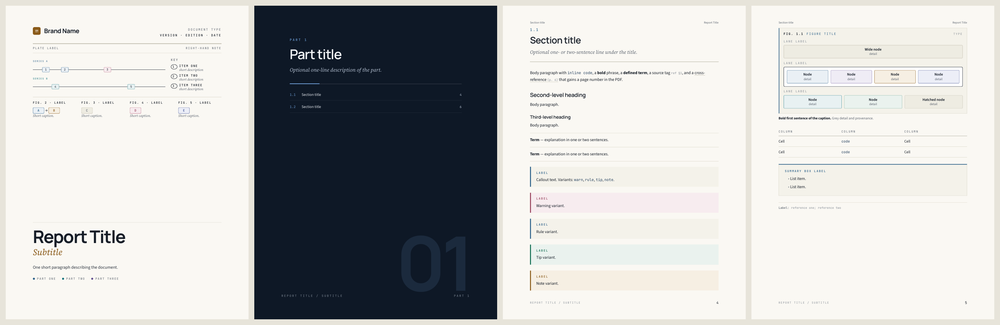
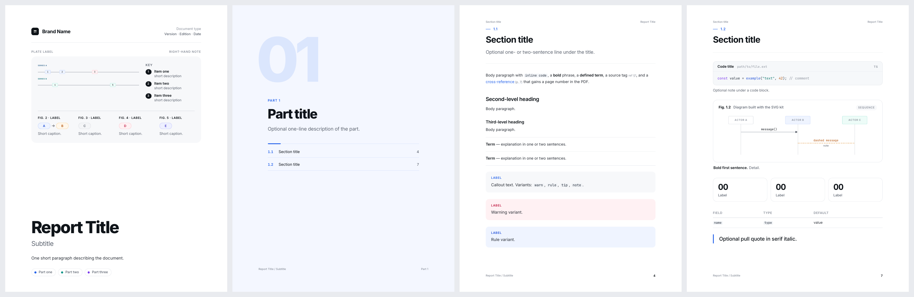

# tech-manual-report

A [Claude Code](https://claude.com/claude-code) skill that applies a visual theme to HTML and PDF reports. It changes how a document looks, not what it says. One HTML source gives you both:

- a web page you scroll through, and
- a US Letter PDF with running headers, page numbers, a contents page with real page numbers, and `(p. 33)` cross-references.

It ships with two themes. Both use the same HTML, so any report can be rebuilt in either one.

## Themes

### `manual` (default)



- **Paper and ink.** Warm off-white pages with navy text, hairline rules, and no shadows or gradients.
- **Type.** Headings in Manrope and body text in Source Sans 3, with Source Serif 4 italic for the line under each title. Labels, code and citations use JetBrains Mono, with labels in spaced-out capitals.
- **Pages.** Dark full-page part dividers with a large faded part number, and a contents page with dotted leaders.

### `minimal`



- **Clean.** White pages, Inter for all text, and plenty of space around everything.
- **One accent per part.** Each part has its own colour, used sparingly on section numbers, links and part pages. Part dividers are lightly tinted pages with a large soft numeral.
- **Soft panels.** Callouts, code, figures and summary boxes sit in rounded, lightly shaded panels with no heavy borders.

### Shared components

`FIG. 1.2` diagram panels with captions, callouts, summary boxes, code blocks, tables, KPI tiles, and HTML and SVG diagram classes. These are styles only; the skill never writes their text.

See `examples/` for the full sample in each theme.

## Install

Clone into your personal skills folder (all projects):

```bash
git clone https://github.com/<you>/tech-manual-report ~/.claude/skills/tech-manual-report
```

Or clone into one project's `.claude/skills/` folder instead.

Then ask Claude Code for a report in the "manual" or "minimal" theme, or run `/tech-manual-report`. Your wording is kept as written.

### Requirements

- Python 3.9+ (standard library only)
- To make PDFs, one of:
  - [WeasyPrint](https://weasyprint.org) (recommended): `brew install weasyprint` or `pip install weasyprint`
  - Google Chrome / Chromium, with `--engine chrome`. This engine leaves running section titles, contents page numbers and cross-reference page numbers blank.
- `pdftoppm` (poppler), if you want to preview PDF pages as images

## Use without Claude

```bash
cp assets/template.html my-report.html     # edit the content
python3 scripts/build.py my-report.html --theme minimal --html out.html --pdf out.pdf
python3 scripts/build.py --list-themes
```

| Option | Effect |
|---|---|
| `--theme manual` / `--theme minimal` | Chooses the theme. Without it, `<meta name="report-theme" content="…">` in the source is used, then `manual`. |
| `--fonts google` | Default for HTML. Small file; loads fonts from Google Fonts. |
| `--fonts embed` | Puts the fonts inside the HTML file. Works offline; about 2–3 MB. |
| `--engine weasyprint` / `--engine chrome` | Chooses the PDF renderer. |

Two `<meta>` tags in the source set the running header and footer:
`<meta name="doc-short" content="…">` and `<meta name="doc-footer" content="…">`.

## Adding a theme

Create `assets/themes/<name>/` with:

- `theme.css`: styles for the same class names as the existing themes. Keep the `/* ---------- inline SVG diagram kit` and `/* ---------- misc` comment markers, because `build.py` copies the rules between them into each SVG diagram.
- `theme.json`: the fonts to load from `assets/fonts/`, a Google Fonts query, and the running header/footer styles. Copy an existing one as a starting point.

## Layout

```
SKILL.md                     instructions Claude follows
assets/themes/manual/        theme.css + theme.json
assets/themes/minimal/       theme.css + theme.json
assets/template.html         every component with placeholder text
assets/fonts/                bundled TTFs + their OFL licenses
references/components.md     markup for each component, palettes, diagram classes
scripts/build.py             HTML/PDF builder
examples/                    the template, built in each theme
```

## Credits

The `manual` theme's visual style is modeled on the *Pi Durable Technical Manual*. The fonts are distributed under the SIL Open Font License 1.1. Copyright notices and the license text are in `assets/fonts/OFL-*.txt`.
